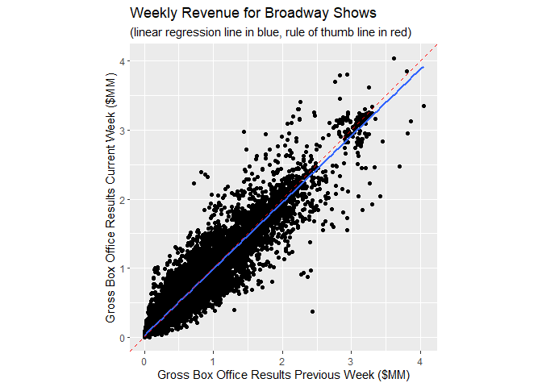

Playbill Data Analysis
================
By: Michael Silva
| Last Updated: 2019-09-28

# Motivation

As part of my CUNY SPS Masters in Data Science training I took a
Business Analytics and Data Mining course. We use Simon Shealther’s *A
Modern Approach to Regression with R* in the class. In chapter 2 he
introduces the topic of simple linear regression. In the excercise
section of that chapter he uses data on gross box office revenue for
plays on Broadway in New York. He gives the following visualization for
the week ending 2004-10-17:

<!-- -->

He later states that “some promoters of Broadway plays use the
prediciton rule that next week’s groos box office results will be equal
to this week’s gross box office results.” The exercise asks you to
examine this claim with the data.

As I worked through this question I was suprised to find that the the
previous week’s revenue really was a good predictor of the current
week’s. Here’s the output of the regression model:

``` r
textbook <- playbill %>%
  filter(week_ending == "2004-10-17") %>%
  filter(!show %in% excluded) %>%
  lm(current_week ~ past_week, data = .)
summary(textbook)
```

``` 

Call:
lm(formula = current_week ~ past_week, data = .)

Residuals:
   Min     1Q Median     3Q    Max 
-36926  -7525  -2581   7782  35443 

Coefficients:
             Estimate Std. Error t value Pr(>|t|)    
(Intercept) 6.805e+03  9.929e+03   0.685    0.503    
past_week   9.821e-01  1.443e-02  68.071   <2e-16 ***
---
Signif. codes:  0 '***' 0.001 '**' 0.01 '*' 0.05 '.' 0.1 ' ' 1

Residual standard error: 18010 on 16 degrees of freedom
Multiple R-squared:  0.9966,    Adjusted R-squared:  0.9963 
F-statistic:  4634 on 1 and 16 DF,  p-value: < 2.2e-16
```

However, something didn’t sit right with me. The conclusion seemed to
defy logic. If the current week’s revenue is predicted by the previous
week’s, then there is basically no change in how much a show makes over
time. The show would run week after week and pull in the same revenue.
That did not make any sense. I began to wonder if the authors
cherry-picked the data for the purpose of the exercise and if the trend
wouldn’t hold if a different week was examined. I decided to look into
this further.

# Data Acquisition

I scrapped playbill.com’s website to collect the gross box office
results for all possible years. The data goes back to as far as
1985-06-16. At the time of this analysis the data goes up to 2019-09-22.
New data continues to be added.

After exploring the data, I compiled a dataset matching what the author
produced. No data was excluded from my dataset. In all there are 1,789
weeks worth of data covering 1,090 shows preformed in 58 theatres.

# Does the Previous Week Predict the Current Week?

So does the previous week’s revenue predict the current week? I looked
deeper into the question. Here’s what I discovered:

The first thing I discovered is that the author threw out data from 5
shows (Brooklyn, I Am My Own Wife, Marc Salem’s Mind Games on Broadway,
Reckless, and Twelve Angry Men). They didn’t explain this nor their
reasoning. So the chart should have looked like this:

<!-- -->

Hmmm. Let’s see what kind of effect this has on the regression model:

``` r
textbook_all <- playbill %>%
  filter(week_ending == "2004-10-17") %>%
  lm(current_week ~ past_week, data = .)
summary(textbook_all)
```

``` 

Call:
lm(formula = current_week ~ past_week, data = .)

Residuals:
   Min     1Q Median     3Q    Max 
-66882 -10036    989  11527  44544 

Coefficients:
             Estimate Std. Error t value Pr(>|t|)    
(Intercept) 2.405e+03  1.010e+04   0.238    0.814    
past_week   9.872e-01  1.636e-02  60.352   <2e-16 ***
---
Signif. codes:  0 '***' 0.001 '**' 0.01 '*' 0.05 '.' 0.1 ' ' 1

Residual standard error: 24890 on 21 degrees of freedom
Multiple R-squared:  0.9943,    Adjusted R-squared:  0.994 
F-statistic:  3642 on 1 and 21 DF,  p-value: < 2.2e-16
```

There doesn’t seem to be any problem with this model. I wonder why they
dropped some rows from the dataset?

## Full Dataset

Now there are 121 times the current or prevous week is zero. Let’s
eliminate these cases from the data set.

``` r
playbill <- playbill %>%
  filter(current_week > 0 & past_week > 0)
```

Now let’s look at the full dataset. We will look at the rule of thumb
(last week predicts this week) and the linear regression line (since
that is what the textbook is about).

<!-- -->

There is definately a positive correlation between the previous and
current week’s box office revenue. The regression line (blue line above)
is similar to the rule of thumb line (in red). Let’s see how the
regression model preformed with more data:

``` r
all_data <- playbill %>%
  lm(current_week ~ past_week, data = .)
summary(all_data)
```

``` 

Call:
lm(formula = current_week ~ past_week, data = .)

Residuals:
     Min       1Q   Median       3Q      Max 
-2003564   -35775    -6446    29796  1573978 

Coefficients:
             Estimate Std. Error t value Pr(>|t|)    
(Intercept) 2.458e+04  8.779e+02    28.0   <2e-16 ***
past_week   9.651e-01  1.219e-03   791.9   <2e-16 ***
---
Signif. codes:  0 '***' 0.001 '**' 0.01 '*' 0.05 '.' 0.1 ' ' 1

Residual standard error: 113000 on 45306 degrees of freedom
Multiple R-squared:  0.9326,    Adjusted R-squared:  0.9326 
F-statistic: 6.27e+05 on 1 and 45306 DF,  p-value: < 2.2e-16
```

That is interesting. With a very high R<sup>2</sup>, the models
indicates that that the current week’s gross box office revenue is
`round(all_data$coefficients[2] * 100, 0)`% of the past week’s revenue.
This is close to but less than one.

## What About Week by Week?

Now this is a little unfair because the example in the textbook only
looked at one week. What if we looked at all the weeks? Here;s the
summary statistics for all of the linear regressions:

``` r
for(week in unique(playbill$week_ending)){
  fit <- playbill %>%
    filter(week_ending == week) %>%
    lm(current_week ~ past_week, data = .)
  row <- data.frame(
    Intercept = as.numeric(fit$coefficients['(Intercept)']), 
    past_week = as.numeric(fit$coefficients['past_week']), 
    adjusted_r_squared = summary(fit)$adj.r.squared,
    week_ending = week
    )
  if(exists("week_by_week")){
    week_by_week <- rbind(week_by_week, row)
  } else {
    week_by_week <- row
  }
}

week_by_week %>%
  select(-week_ending) %>%
  summary()
```

``` 
   Intercept         past_week      adjusted_r_squared
 Min.   :-315631   Min.   :0.3021   Min.   :0.5240    
 1st Qu.:  -5538   1st Qu.:0.9479   1st Qu.:0.9502    
 Median :  12500   Median :0.9830   Median :0.9738    
 Mean   :  18858   Mean   :0.9771   Mean   :0.9574    
 3rd Qu.:  36027   3rd Qu.:1.0122   3rd Qu.:0.9857    
 Max.   : 528262   Max.   :1.8348   Max.   :0.9999    
```

The current week’s revenue is on average 98% of the preceding weeks.
This is close to 1 and the adjusted R<sup>2</sup> are very high so the
rule of thumb seems valid. But it is a fraction of the preceeding week.
This aligns nicely with my expectations.
